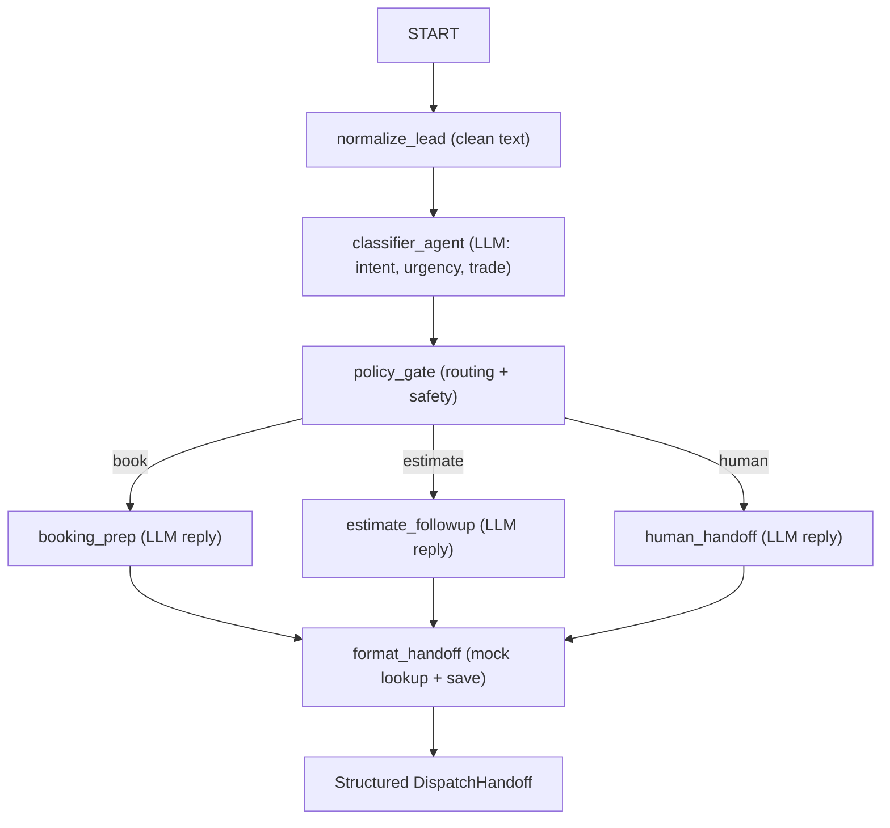

# Home Services Intake Agent

A public showcase agent by **Criterix** demonstrating a production-shaped pattern with
[Google's Agent Development Kit (ADK) 2.0](https://adk.dev/2.0/), deployed to the
[Gemini Enterprise Agent Platform](https://docs.cloud.google.com/gemini-enterprise-agent-platform/agents)
Agent Runtime.

The agent triages an inbound home-services lead, classifies its intent, urgency, and
trade, and produces a clean structured handoff for a human dispatcher — while keeping
the safety-critical decisions in deterministic code rather than the model.

> This is a scoped, safe demo. It uses **mock, in-memory tools only** — there are no
> real CRM, phone, or messaging integrations and no customer data leaves the process.
> It is a public subset of a larger "Home Services Revenue Desk" concept.

## Why this design

A single large prompt is easy to demo and hard to trust. This agent instead uses an
ADK 2.0 **graph workflow**: language models do only what they are good at (understanding
free-text and drafting replies), and a deterministic `policy_gate` node makes the
routing and human-escalation decisions. That separation is what makes the behavior
auditable and safe enough to put in front of a paying customer.



## Behavior

| Inbound message | Route | Why |
|-----------------|-------|-----|
| "My AC is blowing warm air in Plano, can someone come tomorrow?" | book | Bookable HVAC repair |
| "I'm still deciding on last week's condenser estimate." | estimate | Existing estimate follow-up |
| "I want a refund for yesterday's service." | human | Billing/refund always escalates |
| "My heater isn't working, can someone help?" | book | Bookable, with missing details flagged |

The safety policy lives in [`app/policy.py`](app/policy.py): billing, refunds,
cancellations, complaints, and anything the classifier flags as `requires_human` always
route to a human handoff, regardless of the model's own intent. Reply agents never quote
a binding price or confirm a specific appointment time.

## Project layout

```
hs-intake-showcase/
├── app/
│   ├── agent.py             # ADK 2.0 Workflow graph (nodes + edges)
│   ├── policy.py            # Pure, testable routing/safety policy
│   ├── schemas.py           # Pydantic contracts (LeadPayload, IntakeDecision, DispatchHandoff)
│   ├── tools.py             # Mock service-area lookup + lead save (in-memory)
│   └── agent_runtime_app.py # Agent Runtime entrypoint
├── tests/
│   ├── unit/                # Cred-free tests for tools + routing policy
│   ├── integration/         # Live-model workflow tests
│   └── eval/                # ADK evalset + rubric config
├── .agents-cli-spec.md      # Agent specification
└── pyproject.toml
```

## Requirements

- [uv](https://docs.astral.sh/uv/getting-started/installation/) — all Python and package management
- [agents-cli](https://adk.dev/) — `uv tool install google-agents-cli`
- [Google Cloud SDK](https://cloud.google.com/sdk/docs/install) — authenticated with
  `gcloud auth application-default login`

## Quick start

```bash
uv sync --extra eval
cp .env.example .env   # set GOOGLE_CLOUD_PROJECT to your project

# Try it from the command line (each node's output is labeled):
agents-cli run "My upstairs AC is blowing warm air. We're in Plano. Can someone come tomorrow morning?"

# Or open the interactive playground:
agents-cli playground
```

## Tests and evaluation

```bash
uv run pytest tests/unit          # deterministic, no GCP needed
uv run pytest tests/integration   # exercises the live model
agents-cli eval run               # rubric-based quality + safety eval
```

The eval rubric in [`tests/eval/eval_config.json`](tests/eval/eval_config.json) includes a
safety check that responses never quote a binding price, confirm an appointment time, or
promise a refund, discount, or financing term.

## Deploy to Agent Runtime

```bash
gcloud config set project <your-project-id>
agents-cli deploy
```

Deployment uses source-based packaging (no Dockerfile) and takes about 5–10 minutes.
Agent Runtime manages sessions and exports telemetry to Cloud Trace, Cloud Logging, and
Cloud Monitoring by default. Query a deployed agent with:

```bash
agents-cli run --url <reasoning-engine-url> --mode adk "AC not cooling in Frisco, need help this week"
```

## Tech stack

- [ADK 2.0](https://adk.dev/2.0/) graph workflows (Python)
- [agents-cli](https://adk.dev/) for the build / evaluate / deploy lifecycle
- [Gemini Enterprise Agent Platform](https://docs.cloud.google.com/gemini-enterprise-agent-platform/agents)
  Agent Runtime, with Gemini via Vertex AI

## License

Apache 2.0 — see [LICENSE](LICENSE).
